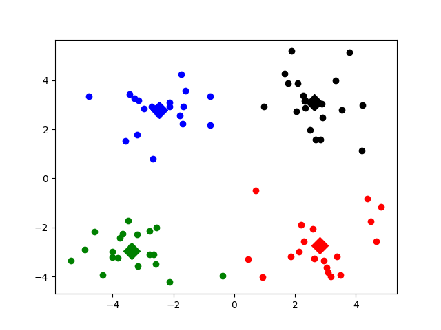
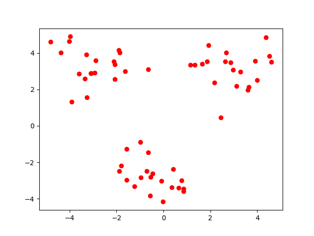
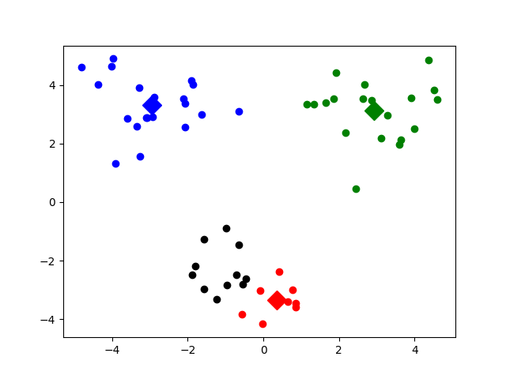
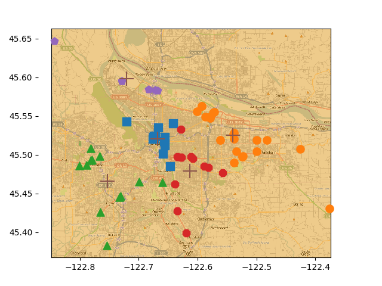

# Ch10 - 利用K-均值聚类算法对未标注数据分组(Grouping unlabeled items using k-means clustering)

#### 以前我们学的都是监督学习算法，现在我们开始学习无监督学习算法。
#### 所谓无监督学习是指事先并不知道要寻找的内容，即没有目标变量。
#### K-means是聚类算法，聚类是将相似的样本分到同一个簇中，类似全自动分类，根据簇内的对象越相似，聚类的效果就越好。K-means是可以发现k个不同的簇，而且每个簇的中心采用簇中所含值的均值计算而成。 聚类与分类的最大不同在于， 分类的目标事先已知，聚类的标签事先不知道。
#### K-均值算法的伪代码如下：
### 创建k个点作为起始质心（通常随机选择）
```
当任意一个点的簇分配结果发生改变时：
        对数据集中的每个点：
                对每个质心：
                计算质心与数据点之间的距离
         将数据点分配到距离其最近的簇
    对每一个簇，计算簇中所有点的均值并将均值作为质心。
```
#### K-均值聚类算法接收4个参数，两个必要参数为数据集和k的值，另外两个为距离计算函数和初始化函数（可修改）。算法采用计算质心-分配-重新计算质心反复迭代的方式，直到所有点的分配结果不再改变。设置flag为clusterChange=True。

#### 聚类算法中，k的值是由用户初始定义的，如何才能判断k值定义是否合适，就需要用误差来评价聚类效果的好坏，误差是各个点与其所属类别质心的距离决定的。K-均值聚类的方法效果较差的原因是会收敛到局部最小值，而且全局最小。一种评价聚类效果的方法是SSE（Sum of Squared Error）误差平方和的方法，取平方的结果是使得远离中心的点变得更加突出。 一种降低SSE的方法是增加簇的个数，即提高k值，但是违背了聚类的目标，聚类的目标是在不改变簇数目的前提下提高簇的质量。可选的改进的方法是对生成的簇进行后处理，将最大SSE值的簇划分成两个（K=2的K-均值算法），然后再进行相邻的簇合并。具体方法有两种：1、合并最近的两个质心（合并使得SSE增幅最小的两个质心）2、遍历簇 合并两个然后计算SSE的值，找到使得SSE最小的情况。

## 测试K-means的数据集


## 运行k-均值聚类的结果示意图


#### 但是K-means的聚类效果比较差，因为很容易收敛到局部最小值，而非全局最小值。所以我们要用新的方法（二分K-means）去改进K-means。

## 二分K-均值算法 
#### 二分K-均值类似后处理的切分思想，初始状态所有数据点属于一个大簇，之后每次选择一个簇切分成两个簇，这个切分满足使SSE值最大程度降低，直到簇数目达到k。另一种思路是每次选择SSE值最大的一个簇进行切分。 满足使SSE值最大程度降低伪代码如下：
#### 将所有点看成一个簇。
```
当簇数目小于k时
        对于每一个簇：
            计算总误差
            在给定的簇上面进行K-均值聚类（k=2）
    计算将该簇一分为二后的总误差
    选择使得误差最小的那个簇进行划分操作
```
## 测试二分K-means的数据集：


## 运行二分K-means的效果图：


# 示例：对地图上的点聚类 
## 原地图：


## 经过二分K-means算法处理后的图：（簇为5）（簇的数目可以手动改变）



