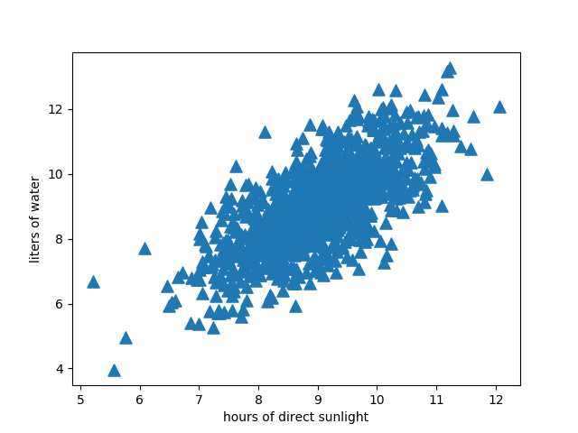
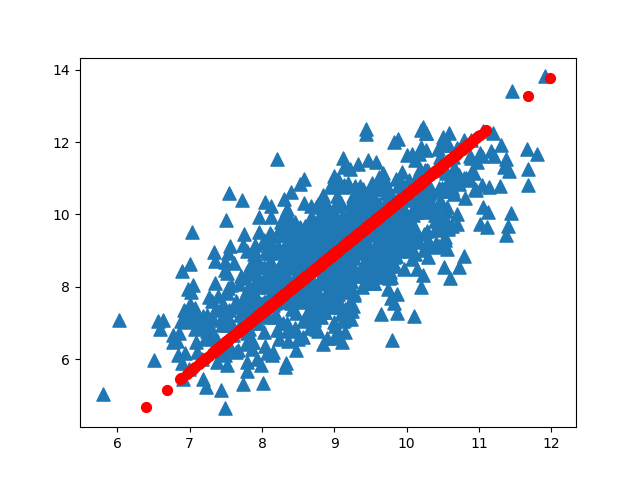
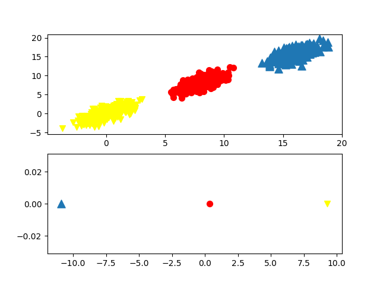
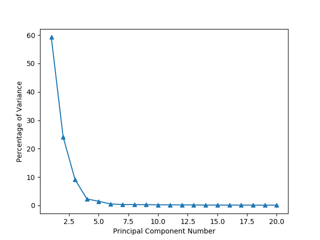

# Ch13 - 利用PCA来简化数据(Using principal component analysis to simplify data)

#### 大量的数据往往拥有超出显示能力的更多特征，但数据显示并非大规模特征下的唯一难题，对数据进行简化也很重要，它可以：
```
使得数据集更易使用。
降低很多算法的计算开销。
去除噪声。
使得结果易懂。
```
## 第一种降维的方法称为主成分分析(Principal Component Analysis,PCA)。
#### 在PCA中,数据从原来的坐标系转换到了新的坐标系,新坐标系的选择是由数据本身决定的。第一个新坐标轴选择的是原始数据中方差最大的方向，第二个新坐标轴的选择和第一个坐标轴正交且具有最大方差的方向。该过程一直重复，重复次数为原始数据中特征的数目。我们会发现，大部分方差都包含在最前面的几个新坐标轴中。因此，我们可以忽略余下的坐标轴，即对数据进行了降维处理。

## 另外一种降维技术是因子分析(Factor Analysis)。
#### 在因子分析中,我们假设在观察数据的生成中有一些观察不到的隐变量(latent variable)。假设观察数据是这些隐变量和某些噪声的线性组合。那么隐变量的数据可能比观察数据的数目少,也就是说通过找到隐变量就可以实现数据的降维。

## 还有一种降维技术就是独立成分分析(Independent Component Analysis,ICA)。
#### ICA假设数据是从 N 个数据源生成的,这一点和因子分析有些类似。假设数据为多个数据源的混合观察结果，这些数据源之间在统计上是相互独立的，而在PCA中只假设数据是不相关的。同因子分析一样，如果数据源的数目少于观察数据的数目，则可以实现降维过程。

## PCA伪代码：
```
去除平均值 
计算协方差矩阵 
计算协方差矩阵的特征值和特征向量 
将特征值从大到小排序 
保留最上面的N个特征向量 
将数据转换到上述N个特征向量构建的新空间中
```
## 数据集


## 降维(一)


#### 上图可以看出，将2维的数据降到1维的直观图。直线是一维。

## 降维(二)


## 示例：利用 PCA 对半导体制造数据降维 
### 总方差的百分比

#### 前六个主成分覆盖了数据96.8%的方差，而前20个主成分覆盖了99.3% 的方差。这就表明了，如果保留前6个而去除后584个主成分，我们就可以实现大概100∶1的压缩比。另外，由于舍弃了噪声的主成分，将后面的主成分去除便使得数据更加干净。

## 总结：
#### 降维技术使得数据变得更易使用，并且它们往往能够去除数据中的噪声，使得其他机器学习任务更加精确。降维往往作为预处理步骤，在数据应用到其他算法之前清洗数据。有很多技术可以用于数据降维，在这些技术中，独立成分分析、因子分析和主成分分析比较流行，其中又以主成分分析应用最广泛。


