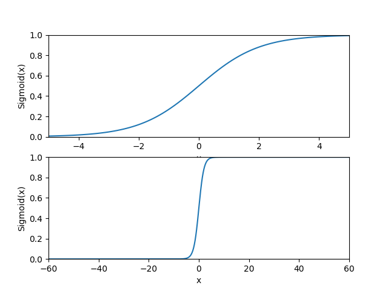
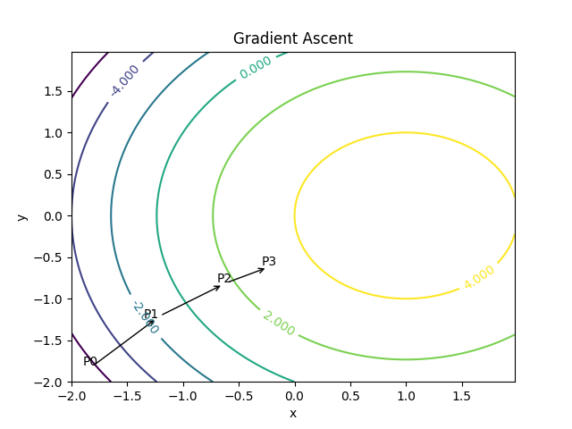
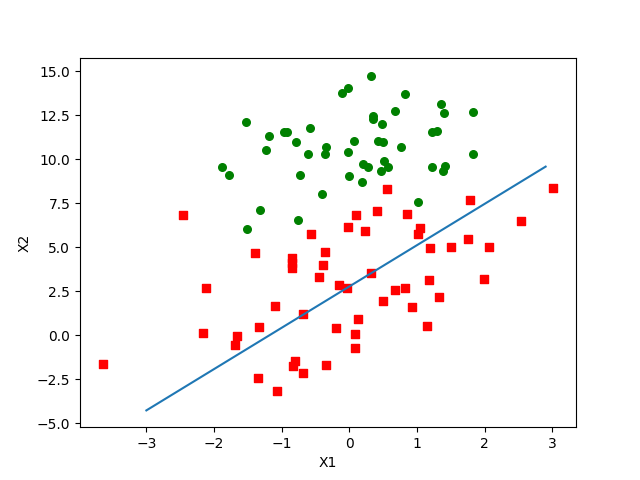
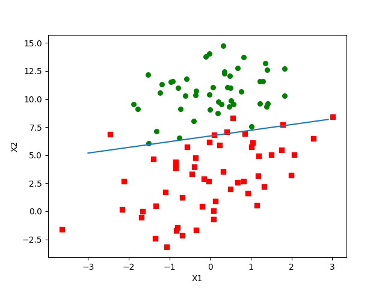

# Ch05 - Logistic回归(Logistic regression)

## Logistic回归的主要思想：
#### Logistic回归是本书目前为止首次接触最优化算法。
#### 根据现有数据对分类边界线建立回归公式，以此进行分类。 
#### 我们想要的函数应该是能接受所有的输入然后预测出类别，两个类的情况下输出0或者1，这种函数叫做单位阶越函数。然而，这种函数的问题在于：
#### 该函数在跳跃点上从0 瞬间跳跃到1，这个瞬间跳跃过程优势很难处理。但幸好的是，另一个函数也有类似的性质，且数学上更容易处理，这就是Sigmoid函数。
## 下图是坐标尺度下的Sigmoid函数图。

## 梯度上升法
#### 这个在机器学习的数学上并不难。先说一个具体的函数例子。

#### 梯度上升算法到达每个点都会重新估计移动的方向。从P0开始，计算完改点的梯度，函数就会根据梯度移动到下一个点P1，梯度再次被重新计算，并沿新的梯度方向移动到P2。如此循环迭代，直到满足停止条件。迭代的过程中，梯度算子总是保证我们能选取到最佳的移动方向。可以看到，梯度算子总是指向函数值增长最快的方向。这里说的只是移动方向，并不是移动量的大小。

# 下面是几个有区别的训练算法效果示意图：

## Logistic回归最佳拟合直线

## 随机梯度上升

## 改进随机梯度上升

