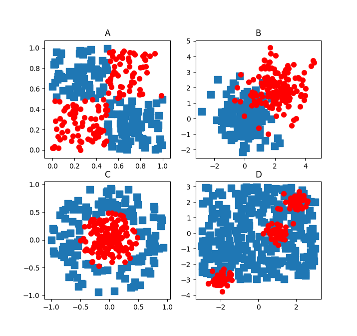
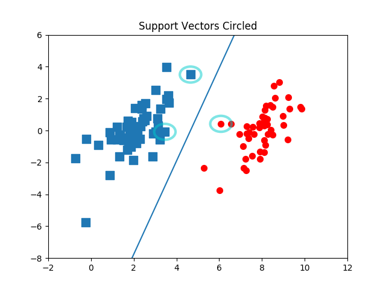
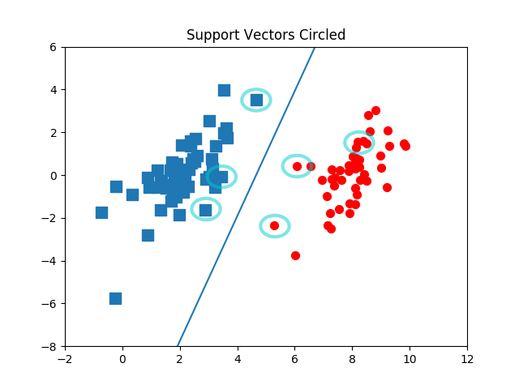
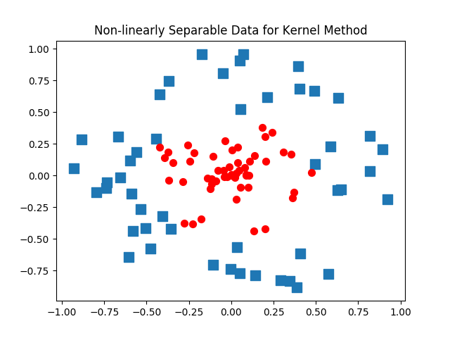

# Ch06 - 支持向量机(Support vector machines)

### 支持向量机是这本书里面最难的一个算法了，其中的原理需要的数学知识最多，当然SVM也是用的非常多的分类器。
### SVM有很多实现，但这章只关注序列最小优化(SMO)算法。同时，介绍一种称为核函数的方式将SVM扩展到更多的数据集上。在Logitic回归中的介绍的数据集中，它们都是可以在途中画出一条直线将两组数据点分开。这组数据又叫做线性可分数据。但是我们的数据不能用一条直线分开时呢？比如下面这些数据点。
## 4个线性不可分的数据集示意图

### SMO算法的目标是求出一系列alpha和b，一旦求出这些alpha，就很容易计算出权重向量w并得到分割超平面。
### SMO算法原理：每次循环中选择两个alpha进行优化处理。一旦找到一对合适alpha，那就增大其中一个同时减少另一个。“合适”是指两个alpha必须要符合一定的条件，条件之一就是这两个alpha必须要在间隔边界之外，而其第二个条件则是这两个alpha还没有进行过区间化处理或者不在边界上。
## 简化版SMO效果图

### 上图是数据集上运行简化版SMO后得到的结果，包括画圈的支持向量与分隔超平面。

## 完整版SMO效果图（优化速度）

### 上图是数据集上运行简化版SMO后得到的结果，包括画圈的支持向量与分隔超平面。和简化版的稍微不同。

## 核方法中的非线性可分数据效果图

### 如果线性不可分的话，我们需要把原始空间的数据映射到一个高维空间，就可以做到线性可分，这里就需要用到核函数。利用核函数可以将数据映射到高维空间，然后进行线性可分。形象例子：https://www.zhihu.com/question/21094489

## 拉格朗日乘子法与KKT条件(自行了解)

## 基于SVM的数字识别（自行写代码）（和KNN类似）
### 进行数字识别，采用SVM要比KNN好。

