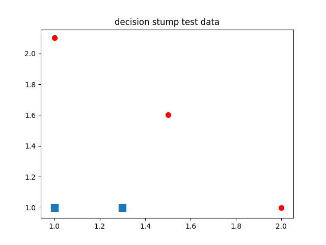
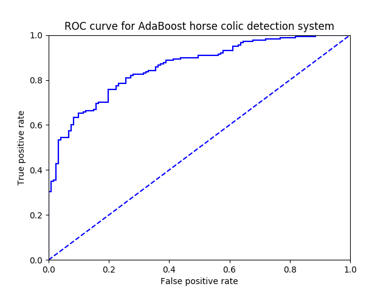

# Ch07 - 利用AdaBoost元算法提高分类性能(Improving classification with the AdaBoost meta-algorithm)

#### 本章用单层决策树作为弱学习器构造了 Adaboost分类器。 实际上，Adaboost函数可以应用于任意分类器，只要该分类器能够处理加权数据即可。

#### 元算法：算法最后的评估，不是靠一个模型给出的结果，而是综合考虑多个模型结果，来得出最后的结果。
 
#### bagging：基于数据随机重抽样的分类器构建方法。
#### boosting：关注被已有分类器错分的那些数据来获得新的分类器。
 
## AdaBoost：
#### 自适应boosting。运行过程：对训练数据中的每个样本，先赋予其一个权重，这些权重开始都相等，先在一个弱分类器上计算错误率，然后在统一数据集上再次训练弱分类器，第二次训练时，将会重新调整每个样本的权重，第一次分对的样本的权重将会降低，分错的样本权重会提高。同时，AdaBoost为每个分类器都分配了一个权重α，这些权重是基于错误率算出来的。具体数学计算公式看书。

#### AdaBoost算法会这样一直迭代，直到训练出错误率为 0 或者到达迭代次数为止。

## AdaBoost的过拟合问题 
#### 多个分类器组合可能会进一步凸显出单分类器的不足。当分类器数目越来越多，训练错误率肯定是越来越小，但是测试错误率却是先减后增，这时就是发生了过拟合。

## 其他分类性能度量指标
#### 包括正确率（precise），召回率（recall），以及ROC曲线等。

