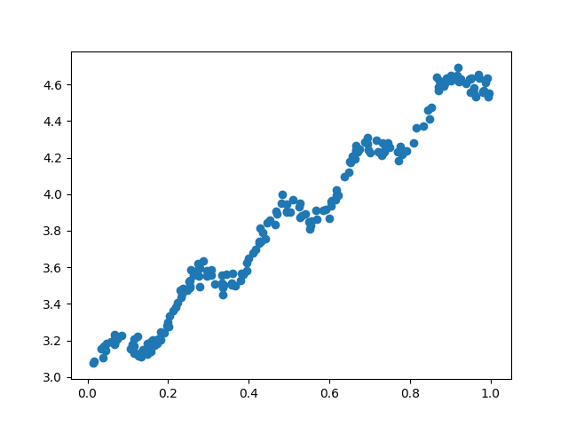
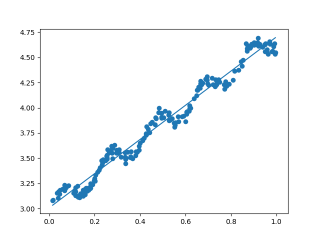
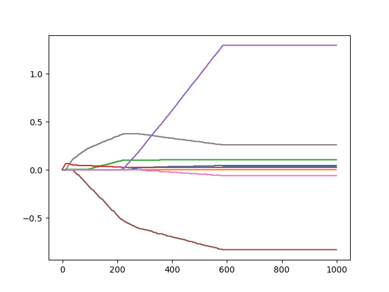

# Ch08 - 预测数值型数据：回归(Predicting numeric values: regression)

### 本章讲的是线性回归，就是找出一系列的回归系数，和Logistic回归很像，但是去掉了sigmoid函数。说到回归，一般指的是线性回归。

### 假如回归系数放在向量w中，这个w可以用普通最小二乘法（OLS），通过使用numpy库的几个函数即可（注意：如果没有检查行列式是否为0就计算矩阵的逆，就会出现错误，使用linalg函数即可）。比如给我们一些数据(ex0.txt)，下图是它们的散点图。

### 通过标准回归函数和数据导入函数，就是使用最小二乘法。得到下图的最佳拟合直线，其实也不是“最佳”，因为这种线性回归会出现欠拟合的情况。

## 局部加权线性回归
### 线性回归中会出现欠拟合的情况，因为它求的是具有最小均方误差的无偏估计。欠拟合可不会有最好的预测效果。面对这种情况，因此，我们需要在估计中引入一些偏差， 从而降低误差。其中一个方法就是局部加权线性回归 (LWLR)。
### LWLR通常使用核来对附近的点赋予更高的权重，最常用的是高斯核。k是高斯核对应的权重中的一个参数。下面3个图分别是k=1.0，k=0.01，k=0.003三种不同取值下的效果图。

### k = 1.0 (和OLS差不多)（欠拟合）
.png)

### k = 0.01 (理想状态，可以挖掘数据的潜在规律)
.png)

### k= 0.003 （考虑了太多噪声）（过拟合）
.png)

## 岭回归
### 这里提到了一种在统计学中叫缩减的技术。
### 使用岭回归和缩减奇数之前，需要对特征做标准化处理。
### 岭回归使用不同的λ系数时的回归系数变化图。

### 该图绘出了回归系数（纵坐标）与 log(lambda)（横坐标）的关系。在最左边，即lambda最小时，可以得到所有系数的原始值(与线性回归一致)，而在右边，系数全部缩减成0。在中间部分的某值将可以取得最好的预测效果。但为找到最佳参数值，还要进行交叉验证。然后自己看一下lasso。

## 前向逐步回归 
### 前向逐步回归算法可以得到与lasso差不多的结果，但更简单。
### 这是一种贪心算法，每一步都尽可能的减少误差，一开始所有权重都设为1，然后每一步所做的决策就是对某个权重增加或减少一个很小的值。 需要设置步数和步长。逐步回归的好处在于能帮助人们理解现有模型并且做出改进，可以找出重要的特征，然后去收集重要的特征的数据。
### 使用0.005的epsilon值并迭代1000次后的结果如下：

## 权衡偏差与方差 
### 误差=偏差+测量误差+噪声，随着模型复杂度增加，训练集的误差降低，但是测试集的误差会先减后增，表明从高偏差过渡到了高方差模型，这里权衡两者是很重要的。

