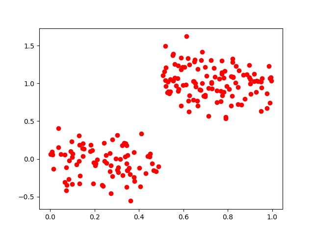
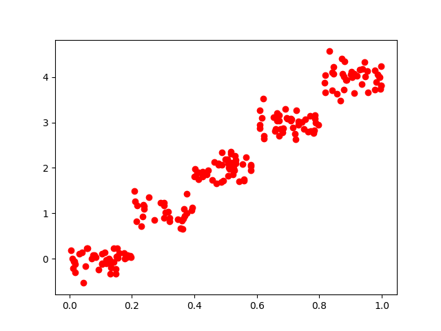

 # Ch09 - 树回归(Tree-based regression)
### 这张介绍了一种新的树算法。叫做CART（分类回归树），该算法即可以用于分类还可以用于回归。同时介绍了树剪枝，其目的是防止树的过拟合。
### 我们第三章介绍了贪心算法的决策树，构建算法是ID3，每次选取当前最佳特征来分割数据，并且按照这个特征的所有可能取值来划分，一旦切分完成，这个特征在之后的执行过程中不会再有任何用处。但这种方法切分过于迅速，不能处理连续型特征值，需要将连续型数据离散化后才能处理，这样就破坏了连续变量的内在性质。
### 二元切分法是另一种树构建算法，每次将数据集切分成两半，如果数据的某个特征满足这个切分的条件，就将这些数据放入左子树，否则右子树。CART（Classification And Regression Trees，分类回归树）使用二元切分来处理连续型变量，并用总方差取代香农熵来分析模型的效果。

### 注意：书中提供的代码好像有点小错误。

## 绘制两个ex0和ex00两个切分后的数据点图：
### ex00.txt：

### ex0.txt

