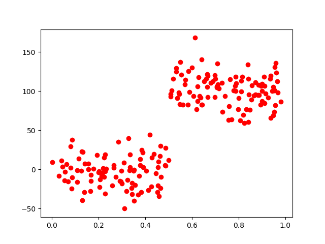
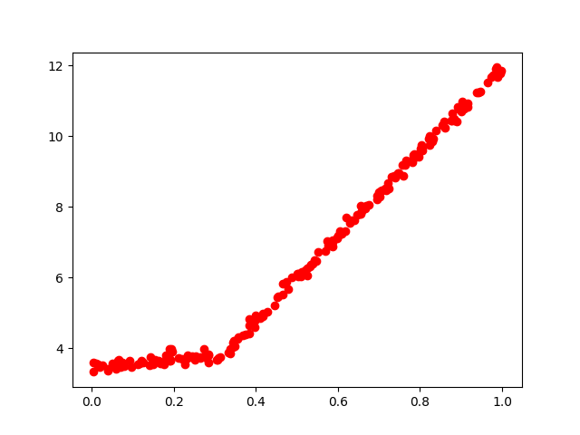
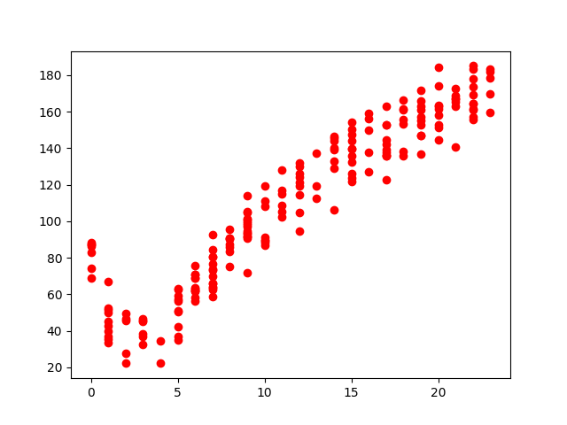

 # Ch09 - 树回归(Tree-based regression)
### 这张介绍了一种新的树算法。叫做CART（分类回归树），该算法即可以用于分类还可以用于回归。同时介绍了树剪枝，其目的是防止树的过拟合。
### 我们第三章介绍了贪心算法的决策树，构建算法是ID3，每次选取当前最佳特征来分割数据，并且按照这个特征的所有可能取值来划分，一旦切分完成，这个特征在之后的执行过程中不会再有任何用处。但这种方法切分过于迅速，不能处理连续型特征值，需要将连续型数据离散化后才能处理，这样就破坏了连续变量的内在性质。
### 二元切分法是另一种树构建算法，每次将数据集切分成两半，如果数据的某个特征满足这个切分的条件，就将这些数据放入左子树，否则右子树。CART（Classification And Regression Trees，分类回归树）使用二元切分来处理连续型变量，并用总方差取代香农熵来分析模型的效果。

### 注意：书中提供的代码好像有点小错误。

## 绘制ex0和ex00两个切分后的数据点图：
### ex00.txt：

### ex0.txt

# 树剪枝
### 如果树节点过多，则该模型可能对数据过拟合，通过降低决策树的复杂度来避免过拟合的过程称为剪枝。我们有两种剪枝的方法，一种是预剪枝，另外一种叫做后剪枝。

## 预剪枝
### 函数chooseBestSplit中的三个提前终止条件是“预剪枝”操作。预剪枝就是对节点的规模做限制，如果节点的规模小于限制，那么不可往下分，还有就是对划分前后总方差的限制，如果变化不大，那么也不可分。但是预剪枝对两个参数的取值很难把握，有时候因为数据的不同，参数对数据数量级十分敏感，一不小心就会造成过拟合。
## 将ex00.txt数据的y轴放大100倍后的新数据集

## 后剪枝
### 后剪枝需要将数据集分为训练集和测试集，先用训练集构造出回归树，然后后剪枝是对树结构的递归操作，如果两个子节点都是叶节点，并且如果合并之后能够降低测试误差，那么进行塌陷处理，就是把这个节点的值设为左右子节点的平均值，然后一层一层递归。简单来说，使用后剪枝方法需要将数据集交叉验证，首先给定参数，使得构建出的树足够复杂，之后从上而下找到叶节点，判断合并两个叶节点是否能够取得更好的测试误差，如果是就合并。

### 一般来说，同时使用预剪枝和后剪枝的作用效果更好。

## 模型树 
### 采用树结构对数据建模，除了将叶节点设定为常数，也可将其设为分段线性函数。回归树的叶子节点是设定为常数值的，而模型树的叶子节点是设定为线性函数的。性函数的节点显然比值节点的树更容易理解，这也是模型树优于回归树的特点之一。

## 下面是用来测试构建模型树的分段线性数据：

### 使用模型树只要修改一下叶节点的生成函数即可，和回归很像。

## 相关系数
### 这里介绍了一下numpy库里面的corrcoef(yHat, y, rowvar = 0)来求解相关系数R^2，越接近1越好。yHat是预测值，y是目标变量的实际值。

## 用于比较树回归模型和普通的线性回归模型的数据散点图。

